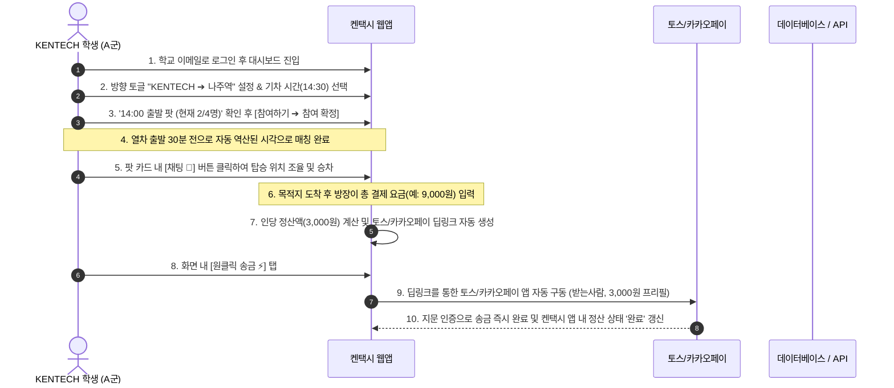

# 🚕 KENTECH - 나주역 택시 쉐어링 웹서비스 PRD Draft
> **Final Project Task 1: Service Idea & PRD Draft**  
> **과목명:** AI 프로그래밍 입문 (Introduction to AI Programming)  
> **제출일:** 2026-06-02  

---

## 1. 팀 정보 (Team Information)

* **팀명 (Team Name):** 켄택시 개발팀 (Team KenTaxi)
* **팀 구성원 (Team Members):**
  * **지수 (팀장/PM & Frontend Lead):** 서비스 기획 총괄, UI/UX 디자인 및 반응형 대시보드 컴포넌트 개발, Zustand 상태 관리 설계.
  * **[팀원 B 이름 입력] (Backend Lead):** Python FastAPI / Node.js Express 백엔드 API 설계, PostgreSQL 데이터 모델링 및 Prisma 연동, 공공데이터포털 철도 API 스케줄러 구현.
  * **[팀원 C 이름 입력] (AI & DevOps Lead):** Socket.io 기반 실시간 1:N 채팅 서버 구축, OpenAI/Gemini API 연동 기반 AI 조율 요약봇 구현, Vercel & Supabase 클라우드 배포 및 검증.

---

## 2. 서비스 명칭 (Service Name)

* **서비스명:** **켄택시 (KenTaxi / KENTECH Taxi Sharing Service)**
* **슬로건:** "KENTECH에서 나주역까지, 똑똑하고 안전한 동승의 시작"

---

## 3. 제품 개요 (Product Overview)

**켄택시(KenTaxi)**는 한국에너지공과대학교(KENTECH) 대학 구성원들이 나주역을 오갈 때 **불필요한 택시 비용 부담을 줄이고 편리하게 동승자를 매칭하고 원클릭으로 송금 정산**할 수 있도록 돕는 **AI 어시스턴트 및 오픈뱅킹 송금 링크 연동형 모바일 반응형 웹 서비스**입니다.  

실시간 철도 운행 정보(SRT & KTX)와 연동되어 기차 시각 기준 스마트 출발 시각을 자동 역산해 주며, 매칭된 탑승객 전용 실시간 채팅방 내에서 AI 조율 도우미가 대화 내용을 분석해 주는 것과 동시에 **토스·카카오페이 딥링크를 결합한 오픈뱅킹 기반 원클릭 이체 연동(Direct Transfer Escrow)**을 제공하여 계좌 입력과 송금 실수의 번거로움을 원천적으로 차단합니다.

---

## 4. 타겟 유저 (Target Users)

* **주요 타겟 (Primary Users):**
  * **KENTECH 학부생 및 대학원생:** 주말/공휴일 귀가 또는 평일 나들이 시 교통 비용을 절감하고자 하는 학생층 (가장 활발한 사용자군).
  * **KENTECH 교직원 및 연구원:** 외근, 출장 등으로 나주역을 빈번하게 오가며 효율적이고 신뢰할 수 있는 이동 수단이 필요한 직군.
* **유저 특성:** 
  * 고정된 대중교통 배차 간격에 피로감을 느낌.
  * 스마트폰을 활용한 실시간 모바일 반응형 서비스에 매우 친숙함.
  * 대학 이메일(`@kentech.ac.kr`) 인증을 통해 상호 신뢰와 안전이 보장된 커뮤니티 내부의 동승을 선호함.

---

## 5. 해결하고자 하는 문제 및 필요성 (Problem or Need)

> [!IMPORTANT]
> **기존 대학생들의 주요 페인 포인트(Pain Points)**
> 1. **과도한 교통비 부담:** 나주역에서 KENTECH 캠퍼스까지 버스 배차가 드물어 택시 이용이 잦으나, 1회 편도 요금이 약 8,000원~10,000원에 달해 학생들에게 경제적 부담이 매우 큽니다.
> 2. **비효율적이고 파편화된 소통:** 현재는 '에브리타임 자유게시판'이나 '카카오톡 오픈채팅방' 등 일시적이고 파편화된 채널을 통해 동승자를 구하고 있어, 실시간 매칭이 어렵고 열차 시간과 출발 시간의 조율 과정에서 피로도가 높음.
> 3. **실시간 정보의 불일치:** 열차가 연착되거나 갑자기 일정이 변동되었을 때, 동승자에게 지연 상황을 즉각 전파하기 어려워 약속이 어긋나는 경우가 빈번합니다.
> 4. **수기 송금 정산의 번거로움과 오탈자 리스크:** 목적지 하차 후 요금을 N분의 1로 정산하기 위해 계좌번호를 수기로 받아 적고, 은행 앱을 각각 켜서 계좌 및 1/N 금액을 직접 입력해야 하는 번거로움이 있으며, 이 과정에서 송금 실수 가능성도 존재합니다.

---

## 6. 핵심 사용자 시나리오 (Core User Scenario)

금요일 오후 서울행 SRT 기차를 타기 위해 나주역으로 이동하려는 KENTECH 학부생 'A군'의 시나리오입니다.



---

## 7. 핵심 기능 요구사항 (Key Features)

### Feature 1: 실시간 기차 시간표 연동 및 타임라인 (Train Timeline)
* **기능 설명:** 공공데이터포털의 실시간 열차 운행 오픈 API를 연동하여 당일/익일 나주역 출/도착 기차(SRT, KTX) 일정을 제공합니다.
* **핵심 기능:**
  * 상행/하행 방향 스위치에 따라 실시간으로 필터링되는 사이드 타임라인 패널.
  * 기차 종류별 구분 배지 표시 및 분 단위 실시간 연착/지연 정보 반영.
  * 현재 시각 이후의 열차를 자동으로 첫 번째 선택 상태로 세팅하여 불필요한 탐색 차단.

### Feature 2: 스마트 출발 시간 계산 및 4인 제한 팟 매칭 (Smart Pool Matching)
* **기능 설명:** 택시 탑승 인원 한도인 4명을 정원으로 두고, 시간 역산을 통해 효율적인 매칭 팟을 구성하는 자동 관리 시스템입니다.
* **핵심 기능:**
  * **자동 역산 로직:** 학교 ➔ 역 이동은 기차 출발 30분 전 자동 추천, 역 ➔ 학교 이동은 기차 도착 즉시 자동 추천해 계산 피로도를 최소화합니다.
  * **인원 현황 인디케이터:** 4개 닷(Dot) 형태의 시각 체계와 남은 정원에 따른 상태 신호등 컬러 🟢(여유) / 🟡(임박) / 🔴(마감) 제공.
  * **원터치 참여 Bottom Sheet:** 복잡한 폼 입력 없이 터치 두 번으로 간편하게 팟을 생성하거나 참여하도록 돕는 바텀 시트 제공.

### Feature 3: 오픈뱅킹 기반 원클릭 이체 연동 및 Direct Transfer Escrow
* **기능 설명:** 사용자가 돈을 플랫폼에 예치할 필요 없이, 토스 및 카카오페이의 송금 딥링크 스키마(Deep Link Schema)를 활용하여 터치 한 번으로 은행 송금을 즉시 완결하는 간편 정산 기능입니다.
* **핵심 기능:**
  * **정산 딥링크 자동 생성:** 방장이 택시 하차 후 실결제 총액을 입력하면 플랫폼이 인원수대로 N분의 1 금액을 자동 계산하고, 각 동승자 화면에 전용 **[토스/카카오페이 원클릭 송금 ⚡]** 버튼을 생성합니다.
  * **송금 프리필(Pre-filled) 시스템:** 사용자가 버튼을 누르면 스마트폰의 토스 또는 카카오페이 앱이 즉시 실행되며, **수신인 계좌번호, 은행, 정확한 정산 금액(예: 3,000원)**이 자동으로 입력된 상태로 로드됩니다. 사용자는 비밀번호나 지문 인증만으로 송금을 즉시 끝마칩니다.
  * **비수신(Zero-Custody) 안전 설계:** 플랫폼이 유저의 예치금을 직접 보관하거나 거치하지 않으므로 전자금융거래법상의 규제 장벽을 완전히 회피하면서도, 안전하고 즉각적인 1:1 송금 인프라와 정산 완료 상태 자동 추적(Direct Transfer Escrow)을 제공합니다.

---

## 8. AI 활용 계획 (AI Usage Plan)

> [!TIP]
> **1. 개발 프로세스에서의 AI 활용 (Agent-assisted Development)**
> * Next.js App Router 아키텍처, Zustand 전역 매칭 상태 설계, Prisma ORM 데이터베이스 스키마 설계 및 Socket.io 이벤트 핸들러 등 핵심 비즈니스 로직을 개발할 때 **AI 코딩 에이전트(Antigravity 등)**와 밀접하게 협업하여 코드 품질과 개발 생산성을 획득합니다.
> * 프론트엔드 UI 컴포넌트의 가독성을 높이고 모바일 터치 반응 속도를 최적화하기 위해 AI 코드 리뷰 및 리팩토링 검증을 진행합니다.

> [!NOTE]
> **2. 서비스 내부 기능에서의 AI 구현 (In-App AI Assistant)**
> * **채팅 맥락 분석을 통한 'AI 조율 도우미':** 대화가 오가는 도중 LLM API(GPT/Gemini 등)에 채팅 컨텍스트를 프롬프트 템플릿과 함께 전달하여, 최종 만남 위치 및 시간, 송금할 은행 계좌번호와 예금주를 실시간 정형화(JSON) 데이터로 추출하고 이를 UI 카드 형식으로 제공합니다.
> * **오픈뱅킹 송금 연동 지원:** 채팅 내에서 AI가 감지한 정산 관련 텍스트(예: "총 만오천원 나왔어요", "신한 110-...")를 기반으로 팝업이나 간편 정산 입력 폼을 활성화하도록 유도하는 지능형 스키마 연동.

---

## 9. 웹사이트 페이지 구조 (Page Structure)

켄택시는 사용자가 스크롤이나 페이지 이동을 최소화하며 단일 화면에서 모든 프로세스를 종결할 수 있는 **싱글 뷰 대시보드(Single-View Dashboard)** 구조를 지향합니다.

```
켄택시 웹서비스 (KENTaxi)
├── 🔑 로그인 및 회원가입 페이지 (/login, /register)
│   └── KENTECH 메일(@kentech.ac.kr) 인증 인프라
├── 💻 메인 대시보드 페이지 (/) - 단일 풀스크린 반응형 레이아웃
│   ├── [상단] 헤더 (Header) : 로고, KENTECH ⇄ 나주역 방향 전환 탭, 내 상태 배지, 아바타
│   ├── [좌측] 열차 타임라인 (TrainTimeline Panel) : SRT/KTX 실시간 정보, 연착 표시 배지
│   ├── [우측] 팟 현황 리스트 (PoolCard Board) : 선택 열차 기준 생성된 팟 목록 카드
│   ├── [하단] 액션 바 (Footer Action Bar) : 팟 만들기 (+) 플로팅 버튼, 내 팟 현황 요약
│   └── 🔽 팟 개설/참여 바텀 시트 (Action Bottom Sheet) : 상세 시간 및 정보 확인
├── 💬 실시간 1:N 채팅 뷰 (ChatPanel) - 우측 보드 영역에서 슬라이드 전환
│   ├── [상단] 팟 정보 헤더 및 AI 조율 도우미 배너 (만남 장소, 정산 계좌번호 자동 요약 노출)
│   ├── [중앙] 실시간 메시지 타운 및 말풍선 목록
│   └── [하단] 텍스트 메시지 송수신창 및 ⚡ [오픈뱅킹 원클릭 송금 정산 패널]
└── 👤 마이페이지 및 프로필 (/profile)
    └── 내 정보 설정, 과거 탑승 이력, 선호하는 정산 수취 계좌번호 등록 및 관리
```

---

## 10. 개발 계획 및 일정 (Development Plan)

### 📅 개발 로드맵 (Roadmap)

| 단계 (Milestone) | 예상 일정 | 핵심 개발 내용 | 담당자 |
|---|---|---|---|
| **1단계: UI Prototype & Mockup** | 06.03 ~ 06.05 | Next.js App Router 구조화, Tailwind & Shadcn UI 기반 대시보드 마크업, Zustand 기반 타임라인 및 채팅 토글 애니메이션 구현 | **지수** |
| **2단계: Database & REST API** | 06.06 ~ 06.08 | PostgreSQL / Prisma DB 스키마 구현, data.go.kr 나주역 열차 운행 스케줄러 동기화, 팟 CRUD 및 인증 API 개발 | **팀원 B** |
| **3단계: WebSocket & Open Banking** | 06.09 ~ 06.11 | Socket.io 실시간 1:N 채팅 연결 및 WebSocket 이벤트 처리, 토스/카카오페이 송금 딥링크 스키마 연동 테스트 및 간편 정산 구현 | **팀원 C** |
| **4단계: AI Integration & Deploy** | 06.12 ~ 06.14 | OpenAI/Gemini API 연동 채팅 분석 요약 봇 결합, 모바일 반응형 디버깅, Vercel & Supabase 최종 퍼러블리싱 배포 | **전원** |

---
*본 문서(PRD)는 팀원 간의 유기적인 피드백을 통해 기획과 디자인 방향에 맞추어 지속적으로 업데이트 및 보완될 예정입니다.*
